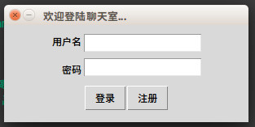
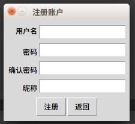
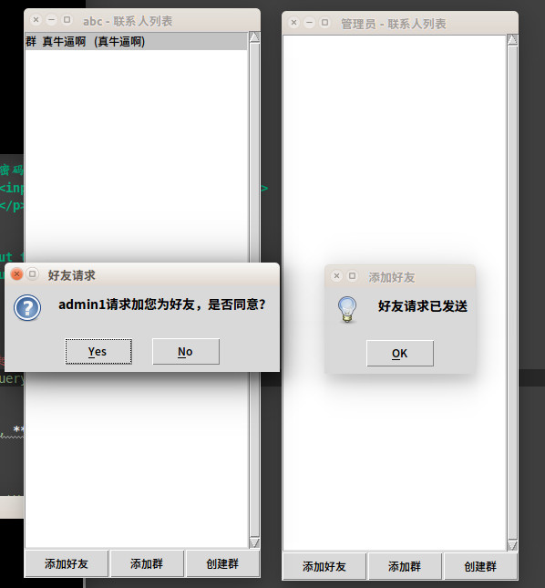
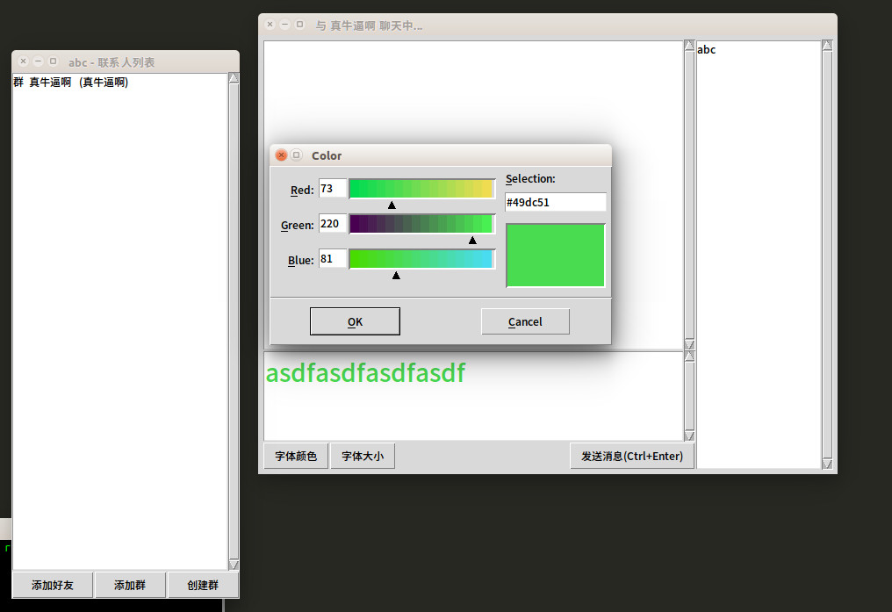
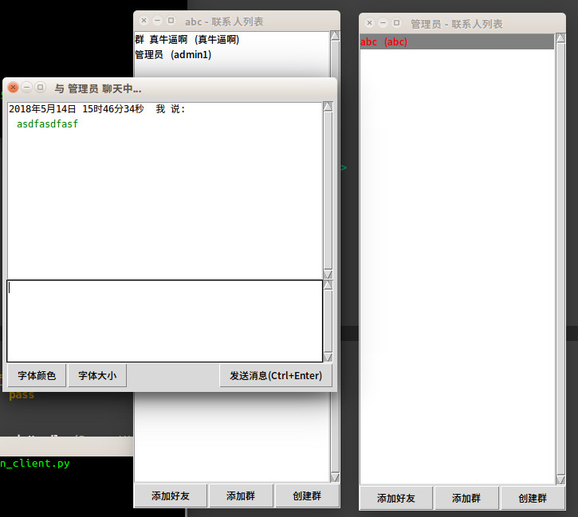

# 项目简介
简易聊天室
Author: by @jeremyjone(张维)
Date: 2018-5-10
项目会保存在: https://github.com/jeremyjone


# 功能
- [x] 用AES加密所有的传输内容
- [x] 用MD5 + 加盐 的方式存储密码，加盐字符由客户端和服务器共同生成
- [x] 使用数据库存储用户信息、好友关系、房间信息、加入房间状态、所有聊天记录
- [x] tkinter GUI
- [x] 有新消息时自动好友列表提示
- [x] 窗口放大缩小
- [x] 联系人列表；未读的消息用彩色文本标注
- [x] 加好友功能，对方收到通知，通过/拒绝，并将添加记录添加到数据库
- [x] 右键好友名可以删除好友关系
- [x] 防止重复打开窗口，如果已经打开则使窗口获得焦点
- [x] 用户离线时收到的未读的消息，再次登录时用彩色文本标注
- [x] 支持多行内容（Enter换行，Ctrl+Enter发送）；支持聊天字体的设置
- [x] 群聊功能、加群、创建群
- [x] 群聊中显示群成员（双击打开聊天窗口/发送好友请求）

# 安装说明
Python版本: 3.5

```
pip install pycrypto # 用于加密
```

# 运行方法
```
python run_client.py
python run_server.py
```
（一次只能运行一个server，但可以运行N个client）

第一次运行前，先运行
```
first_time_run_server_create_database.py 1
```
可以快速创建数据库，（需要有参数1）；
参数为2时创建几条数据，方便使用（前提创建好数据库）；
参数为3时，删除数据库


# 文件目录
```
│   first_time_run_server_create_database.py
│   README.md
│   run_client.py
│   run_server.py
│
├─client
│   __init__.py
|
│   chat_form.py
│   contact_form.py
│   login.py
│   register.py
│   memory.py
|
│   client_socket.py
|   common_socket.py
|   security.py
|
└─server
    __init__.py
    
    DB_Handler.py 
    server_windows.py
    common_handler.py
    server_socket.py
    memory.py
    
    register.py
    login.py
    mamage_friend.py
    manage_group.py
    chat_msg.py
```

# 预览图






# 自制信息传输协议说明

1. 无状态。
2. 使用时，函数可以传入任意多个需要传送的数据，注意需要传入二进制文件。
3. 每个Type对应一种固定的操作，对应固定的参数列表，Type类型需要在调用函数时提供。

这种设计的优点

1. 简单易懂，易于测试（因为无状态）。
2. 灵活方便，无需为不同的操作类型写不同的处理程序。
3. 可以传输非常复杂的数据结构（如：登入时的所有N条未读消息（每条都含有发件人/时间/消息内容/甚至图片二进制）都是放在一个包里的）。
4. 可以传输任意的二进制文件，对于功能扩展非常方便，比如图片、音视频等等。
5. 可以很好的与其他语言编写的端口进行数据交互（C、C++等）

这种设计的缺点

1. 所有数据没有进行压缩处理，略浪费流量。

在数据传输的基础上，增加安全性层级：

1. 自制的数据传输协议上，套加一层加密处理（密钥现在是固定的，可以扩展为数据交换两端共同计算得出的结果）。


# 协议详细说明

*注：具体实现可以看```commcon_handler.py```*

协议设计的宗旨是：无状态、分层设计、包头是数据Type，然后是数据内容，指定打包的第一层解包格式为"!L"。

网络包分为三层，第一层（外层）为数据加密层，第二层为数据结构层，第三层（内层）为数据体。构造分别如下：

## 层1：

1. Message Body *被AES加密的内容*

## 层2：

1. Message Type *发送的数据类型，根据数据类型分发数据*
3. Format of Data *具体数据的打包格式*

## 层3（基础类型如int、str、bool、float、binary等）：

1. Packed Data (Using struct.pack in Python) *(直接转成bytes)*

一般来说，真正使用时，会直接给函数传递多个参数，这样可以一次和服务器交换多个参数。

比如```socket.send(MessageType.login, username, password)```

这种设计非常强大，结合AES加密，可以无缝和服务器**安全**交换非常复杂的数据。比如，一个用户的所有离线未读消息（有N条，每条可能是不同的房间、不用的发送者，都包含不同的时间、字体大小，可能还有图片），可以通过一个包发送给客户端，效率非常高。

# 用MySQL存储用户信息、消息记录等各种数据
数据库结构如下：

```
create table userinfo(
    -> id int primary key auto_increment,
    -> username varchar(50) unique not null,
    -> password varchar(254) not null,
    -> nickname varchar(50) not null,
    -> reg_time timestamp not null,
    -> isActive boolean not null)default charset=utf8;

create table chatmsg(
    -> id int primary key auto_increment,
    -> user_id int not null,
    -> send_time timestamp not null,
    -> target_id int not null,
    -> isRead boolean not null,
    -> msg_type tinyint not null,
    -> msg varchar(4096) not null,
    -> isActive boolean not null)default charset=utf8;

create table userfriend(
    -> id int primary key auto_increment,
    -> user_id int not null,
    -> friend_id int not null,
    -> add_time timestamp not null,
    -> isActive boolean not null)default charset=utf8;

create table chatroom(
    -> id int primary key auto_increment,
    -> chatroom_name varchar(30) unique not null,
    -> create_time timestamp not null,
    -> isActive boolean not null)default charset=utf8;

create table chatroom_user(
    -> id int primary key auto_increment,
    -> chatroom_id int not null,
    -> user_id int not null,
    -> create_time timestamp not null,
    -> isActive boolean not null)default charset=utf8;
```

我做的所有数据没有delete选项，只有逻辑删除，默认isActive都为1，如果不需要了，改为0即可达到删除效果。

```chatmsg```表可以保存不同类型数据，用msg_type保存数字即可，默认聊天数据为1，系统消息为2，添加好友信息为3，群聊信息为4，这样可以方便不同类型消息的扩展；保存消息时先判断用户是否在线，如果在线，直接发送给用户并在保存数据时将isRead项保存为0，否则保存为1，当用户上线时读取该用户isRead项为1的所有消息。

# 功能扩展

该程序分层设计，可扩展性良好，添加不同模块，定义不同的Type类型即可。
1. 添加表情
2. 传图
3. 传文件
4. 在聊天窗口显示类似QQ秀的可视化视图
5. 改进好友列表，使用Frame可以显示更多信息，比如未读消息条数，未读消息的概要，好友在线离线等
6. 改进信息交换机制，进一步支持更多更全的功能

未完待续...

# 目前问题

1. 收取群聊信息，如果发送方和接收方为好友，那么接收方会在私聊接收到，问题已定位。
2. 客户端tkinter弹出框卡死，线程锁问题，但是目前还没想好将线程锁添加在什么地方。
